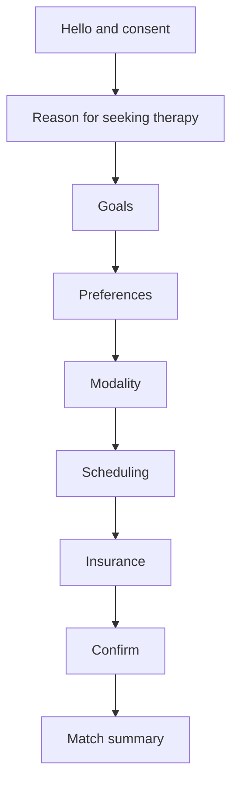

# Therapist Matching Intake Assistant

## Overview
A guided intake conversation that reduces drop-off, captures client preferences, and improves therapist matching.

## Problem
Long intake forms can feel overwhelming. Clients may skip important details about goals or preferences, which can lead to weaker matches and rescheduling.

## Flow Diagram

## Example Dialog
**Assistant:** Hi, I will ask a few short questions to help match you with a therapist. You can skip anything. Ready?  
**User:** Yes.  
**Assistant:** What brings you to therapy?  
**User:** Anxiety at work.  
**Assistant:** Thank you. What would you like therapy to help with?  
**User:** Reducing anxiety and sleep.  
**Assistant:** Got it. Do you have any therapist preferences?  
**User:** Someone direct and practical.  
**Assistant:** Thank you. Do you prefer virtual, in-person, or either?  
**User:** Virtual.  
**Assistant:** When are you usually available?  
**User:** Evenings.  
**Assistant:** Will you use insurance or self-pay?  
**User:** Insurance.  
**Assistant:** Great. Here is your summary. Does this look correct?  
**User:** Yes.  
**Assistant:** Perfect. I will find your therapist match.
