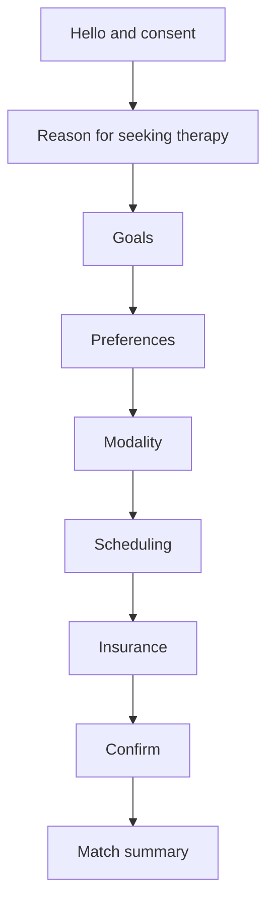

# Therapist Matching Intake Assistant

## Overview
A step-by-step intake conversation that replaces long forms with a friendly chat. Goal: reduce drop-off, capture preferences, and improve match quality.

## Problem
New clients often feel anxious when completing long forms. Important details about their goals or preferences may be missed, which can lead to poor matches and reschedules.

## Flow Diagram

## Example Dialog
**Bot:** Hi, I will ask a few short questions to help match you with a therapist. You can skip anything. Ready?  
**User:** Yes.  
**Bot:** What brings you to therapy?  
**User:** Anxiety at work.  
**Bot:** Thanks. What would you like therapy to help with? (options)  
**User:** Reducing anxiety and sleep.  
**Bot:** Got it. Any therapist preferences?  
**User:** Someone direct and practical.  
**Bot:** Thanks. Do you prefer virtual, in-person, or either?  
**User:** Virtual.  
**Bot:** When are you usually available?  
**User:** Evenings.  
**Bot:** Will you use insurance or self-pay?  
**User:** Insurance.  
**Bot:** Great, here is your summary. Looks good?  
**User:** Yes.  
**Bot:** Perfect. Let’s find your therapist match.
