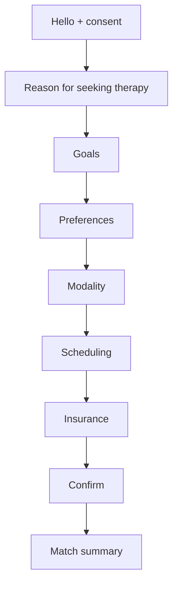

# Therapist Matching Intake Assistant

## Overview
A friendly, stepwise intake that replaces cold forms with a short conversation. Goal: reduce drop-off, capture key preferences, and improve initial match quality.

## Problem
New clients often feel anxious and overwhelmed by long forms. Important nuances about goals, scheduling, modality, or preferences get skipped or rushed, leading to poorer matches and rescheduling.

## Users & Goals
- **New client** wants to feel understood and get matched quickly.
- **Provider ops** wants clean, structured data to route accurately.

## Constraints
- Respect privacy, collect the minimum necessary.
- Offer “skip” or “prefer not to say” for sensitive items.
- Never give clinical advice; this is intake only.

## Flow Diagram

