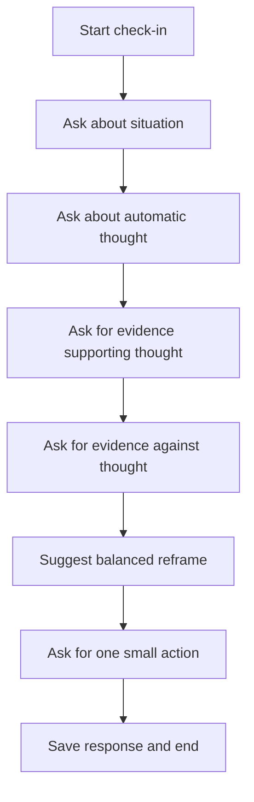

# CBT Self-Help Coach

## Overview
A short between-session exercise that guides a CBT thought record. Identify the situation, automatic thought, evidence for and against, balanced reframe, and a small action.

## Problem
Clients often forget or avoid CBT homework. A guided chat lowers the effort and supports skill practice.

## Flow Diagram

## Example Dialog
**Assistant:** Want a quick CBT check-in?  
**User:** Sure.  
**Assistant:** Briefly, what happened?  
**User:** My manager criticized my work.  
**Assistant:** What thought came to mind?  
**User:** I’m terrible at my job.  
**Assistant:** What facts support that thought?  
**User:** I missed a deadline.  
**Assistant:** What facts do not support it?  
**User:** I have met most goals and had good feedback.  
**Assistant:** Balanced reframe: “I had a difficult moment, but overall I meet expectations and can improve this part.” Does that sound right?  
**User:** Yes.  
**Assistant:** What is one small step you can take today?  
**User:** Block time to plan my next task.  
**Assistant:** Great. I will save your reframe so you can revisit it later.
