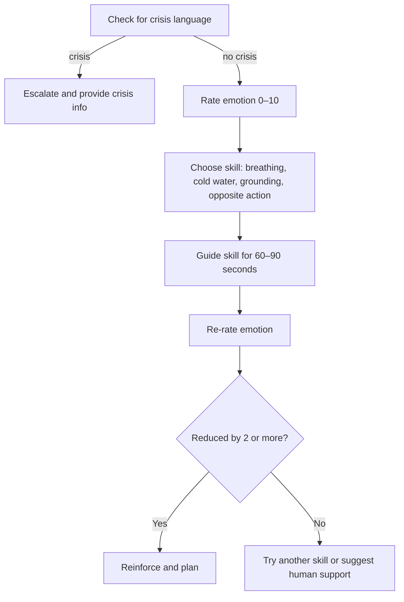

# DBT Distress De-escalation

## Overview
A skills-based flow to reduce emotional intensity using DBT techniques such as paced breathing, grounding, and opposite action. Includes clear safety guardrails.

## Problem
People in distress may need quick, structured support to calm down. Without guidance, emotional intensity can remain high or escalate.

## Flow Diagram

## Example Dialog
**Assistant:** Are you safe right now? If you are in immediate danger, please call your local emergency number.  
**User:** I am safe, just overwhelmed.  
**Assistant:** Thank you for telling me. On a scale of 0 to 10, how strong is the feeling right now?  
**User:** 8  
**Assistant:** Let’s try paced breathing. Inhale for 4, exhale for 6. Ready?  
*(guides for 60 seconds)*  
**Assistant:** Where is the intensity now?  
**User:** 5  
**Assistant:** That is progress. Would you like to make a note about what helped?
