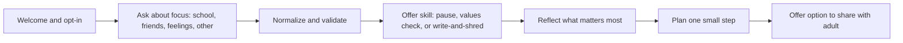

# Teen Support Buddy

## Overview
A teen-friendly check-in that normalizes stress, offers short ACT and mindfulness skills, and encourages healthy communication with trusted adults.

## Problem
Teens often prefer short, supportive interactions. Without age-appropriate tools, they may disengage or feel misunderstood.

## Flow Diagram

## Example Dialog
**Assistant:** Hi. Do you want a quick check-in or to try a stress skill?  
**User:** Skill.  
**Assistant:** Let’s do a three-breath pause. Inhale… exhale… again… one more.  
**Assistant:** What matters most to you right now? Friends, creativity, kindness, something else?  
**User:** Friends.  
**Assistant:** Good. What is one small thing today that supports that?  
**User:** Text my friend back.  
**Assistant:** Sounds good. Would you like a reminder later?
