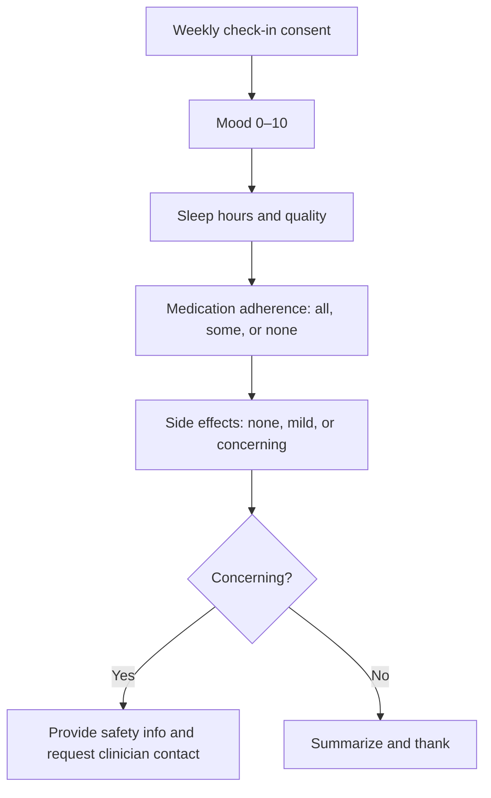

# Psychiatry Follow-Up and Side-Effects Tracker

## Overview
A weekly check-in that helps clients track mood, sleep, adherence, and side effects. Concerning patterns are flagged for clinician review.

## Problem
Psychiatry visits are often spaced weeks apart. Without interim check-ins, side effects or mood changes may go unnoticed.

## Flow Diagram

## Example Dialog
**Assistant:** Weekly check-in. How was your mood overall, 0 to 10?  
**User:** 4  
**Assistant:** Thank you. About how many hours did you sleep on average?  
**User:** 6  
**Assistant:** Any side effects you want to note? None, mild, or concerning?  
**User:** Mild headache.  
**Assistant:** Logged. If headaches last or worsen, please contact your prescriber. Summary saved.
